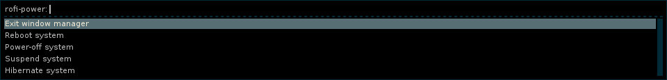

# Rofi Tools

Tools for and with [rofi](https://github.com/DaveDavenport/rofi).

Please have a look at [rofi-scripts](https://github.com/carnager/rofi-scripts)
as well.

## i3-color-rofi

Fetches your current i3 wm colors and provides an options string to
color rofi similar to i3. Currently only supports rofi before V1.0.0.

### Usage

Append it to your rofi command line:

    rofi <your-options> $(i3-color-rofi)

*i3-color-rofi* generates an options string, so the resulting line may be:

    rofi -show run -bg #222222 -fg #888888 -hlbg #285577 -hlfg #ffffff

### TODO

* compatibility with V1.0.0
* use font from i3's configuration
* improve colors usage

## rofi-power

Provides a menu to call systemctl for shutdown, reboot, suspend etc. It also
shows an entry to exit the window manager if you provide an exit command.
If suspend or hibernate is selected then i3lock is called to have the screen
locked after waking up the system, if USE_LOCKER is set to 'true' in the config file.
You can also change the program to be used as the screen locker by modifying the
variable LOCKER.

### Usage

Copy the *config.sample* file to *$HOME/.config/rofi-power/config* and customize it as you like.

Then run *rofi-power* and append an exit command, for i3, for example:

    rofi-power "i3-msg exit"

You can use it with herbstluftwm as well:

    rofi-power "herbstclient quit"

## rofi-virtualbox

Provides a menu to start, power-off, clone, delete etc. virtualbox machines. You select the machine first and the
action to be executed afterwards.

### TODO

* config file
* pause machine
* better way of handling options and corresponding functions - like boosta

# License

All tools are released under the terms of the GNU General Public License v2:

[http://www.gnu.org/licenses/old-licenses/gpl-2.0.txt](http://www.gnu.org/licenses/old-licenses/gpl-2.0.txt)
